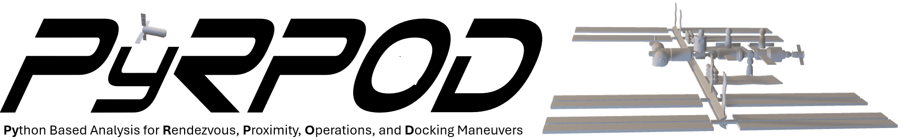

# PyRPOD
Python Based Analysis of Rendezvous, Proximity, Operation, and Docking Maneuvers (PyRPOD)


## Overview
This code simulates jet firing histories, vehicle dynamics, and plume impingement interactions to study RPOD (Rendezvous, Proximity Operations, and Docking) maneuvers relevant to active space-station operations.

The objective is to enable rapid analysis of early vehicle designs to assess compliance with competing mission requirements and to explore design spaces for iteration toward an optimal design. Ideally, this tool aims to increase operational safety and decrease design costs of active space-station operation. The project features parameterized simulation cases, fuel efficiency calculations, plume-surface interaction modeling, and automated transformations between STL and VTK formats to support flexible data visualization.

PyRPOD utilizies scientific libraries such as NumPy, SciPy, Matplotlib, and SymPy, with outputs in STL and VTK formats suitable for visualization in ParaView. Modular testing and validation cases ensures accuracy code resiliency for future developments. The target audience for this code is researchers and engineers in aerospace engineering and computational modeling.

## Directory Structure

- `case/`: Contains specific case configurations, results, and model transformations.
- `data/`: Stores raw data files used across cases, including flight plans, STL models, and test definitions.
- `pyrpod/`: Python modules for running and managing simulations (main source code).
- `tests/`: Unit, integration, and verification tests for the project.
- `validation/`: Validation and Verification Tests of physical models used.
- `requirements.txt`: Lists project dependencies for environment setup.

## Getting Started
1. Clone the repository:
   ```bash
   git clone https://github.com/plume-kit/PyRPOD
   ```
2. Install dependencies:
   ```bash
   pip install -r requirements.txt
   ```

3. Run all test cases.
   ```bash
   python -m pytest
   ```
   It is recomended to use `python -m pytest` rather than the bare `pytest` command. This guarantees the
   `python` you're currently using (venv, conda env, etc.) runs the tests, avoiding
   `ModuleNotFoundError`s that show up if a system-wide `pytest` (e.g. installed via
   `apt`) ends up on your `PATH` instead of the one in the environment where you ran
   `pip install -r requirements.txt`.

4. Run a subset of test cases using markers (auto-tagged by category and subsystem).
   ```bash
   python -m pytest -m unit             # unit tests only
   python -m pytest -m integration      # integration tests only
   python -m pytest -m verification     # verification tests only
   python -m pytest -m rpod             # a specific subsystem (mdao, mission, plume, rpod)
   python -m pytest tests/rpod          # or just point pytest at a directory/file directly
   ```

## Test Reporting

Test information lives in two places, and the split is deliberate:

| | Where | Owned by | Committed? |
| --- | --- | --- | --- |
| **Execution outcome** (passed / failed / skipped, for one run) | `reports/pyrpod-pytest-report.html` | pytest | No — `reports/` is git-ignored |
| **Development status** (implemented / placeholder / blocked / ...) | [`tests/test_manifest.yaml`](tests/test_manifest.yaml) → [`tests/README.md`](tests/README.md) | maintainers | Yes |

A passing test is *not* evidence that a test is finished: several placeholder
tests contain no assertions and are explicitly skipped so they can never be
mistaken for coverage.

1. Install the reporting dependencies once (declared as the `test` dependency
   group in `pyproject.toml`):
   ```bash
   python -m pip install "pytest-html>=4.2,<5" "PyYAML>=6"
   ```
   With pip 25.1 or newer you can instead run `python -m pip install --group test`.

2. Generate the dashboard and the HTML report:
   ```bash
   python scripts/generate_test_dashboard.py
   ```
   This validates the manifest, cross-checks it against pytest's current
   collection, regenerates `tests/README.md`, then runs the suite and writes a
   self-contained `reports/pyrpod-pytest-report.html`. It exits with pytest's
   own exit code, and the report is written even when tests fail. Use
   `--inventory-only` to refresh `tests/README.md` without running the suite,
   or `--check` to verify it is up to date.

3. When you add a test, add a matching entry to `tests/test_manifest.yaml`.
   The generator fails with an explicit list of missing or stale entries
   otherwise.

CI runs the same command on every pull request and every push to `master`, and
uploads the report as the **`pyrpod-test-report`** artifact (retained 14 days),
including when tests fail. Download it from the *Artifacts* section of the
workflow run summary on the Actions tab.

## Logging

PyRPOD ships a formal, opt-in operational logging system built entirely on the
Python standard library. **Importing PyRPOD has no logging side effects** — no
files, directories, handlers, or root-logger changes. Applications turn logging
on explicitly:

```python
from pyrpod.logging_utils import configure_logging

session = configure_logging(case_dir)
try:
    # ... run the PyRPOD workflow, e.g. study.jfh_plume_strikes() ...
    session.finalize("successful")
finally:
    session.close()
```

Runtime logs are written to `<case_dir>/results/logs/<case-name>_<timestamp>.log`
(a new file per run). Behavior is configured per case via an optional
`<case_dir>/logging.ini`, with environment variables (`PYRPOD_LOG_LEVEL`,
`PYRPOD_LOG_FORMAT`) and explicit API arguments taking precedence.

See [docs/logging.md](docs/logging.md) for the full architecture, the
`logging.ini` schema ([example](docs/logging.ini.example)), configuration
precedence, log-level guidance, input checksums, configuration snapshots,
performance/memory caveats, and serial-fallback behavior.